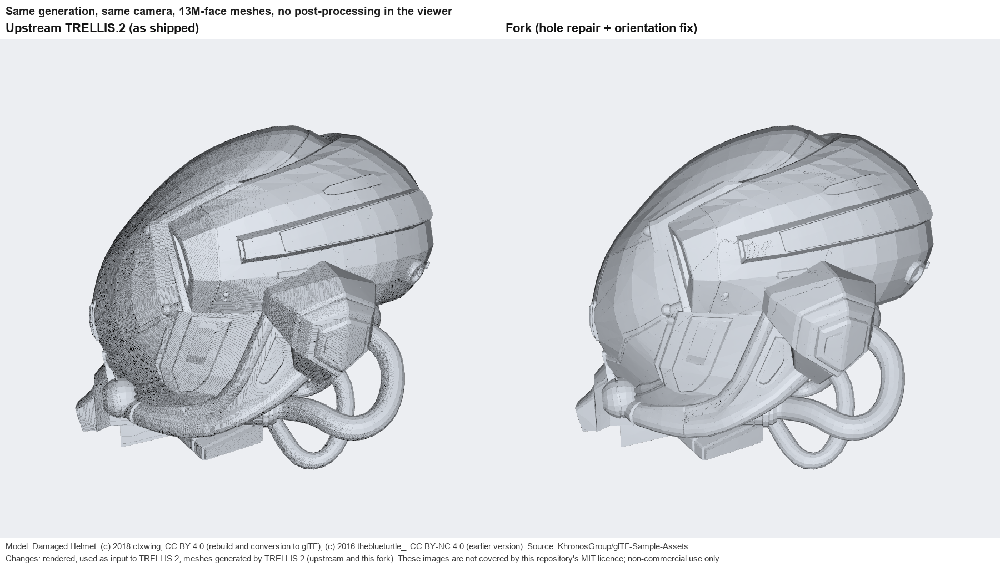
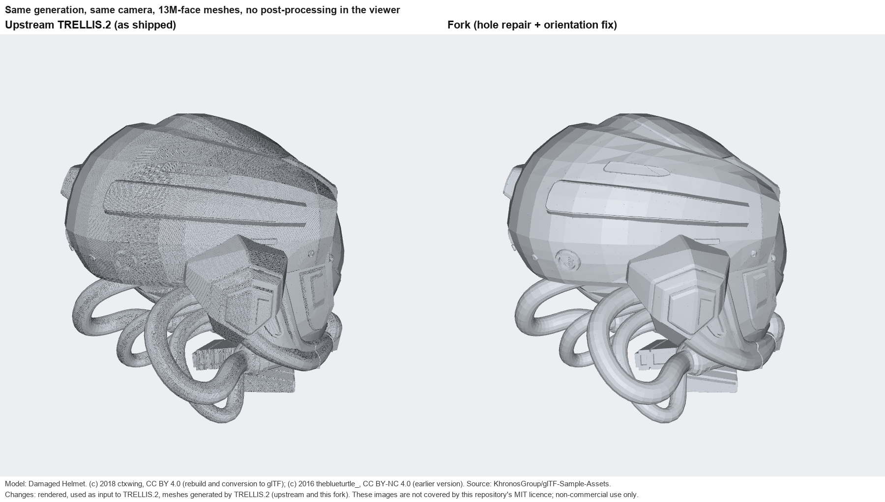
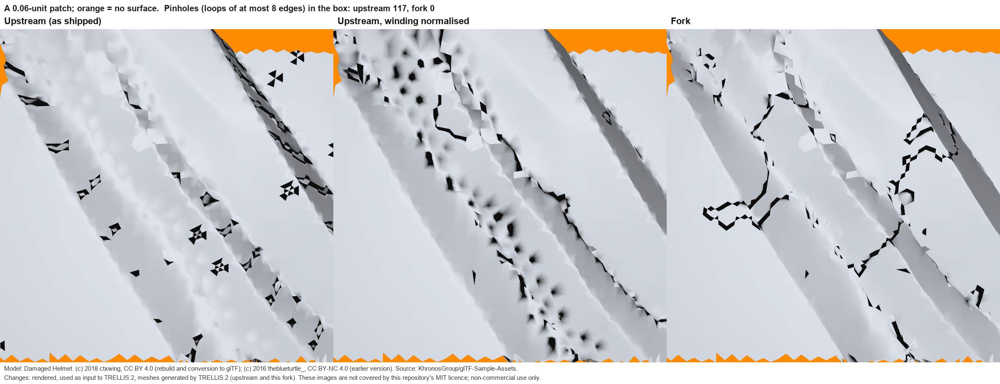

# Modifications in this fork

This fork of [microsoft/TRELLIS.2](https://github.com/microsoft/TRELLIS.2) changes how the generated mesh is post-processed.  Nothing about the model, the sampling or the
voxel data changes; the surface positions are identical to upstream (distance to the source asset: chamfer 0.0040, F-score at 1 % of the bounding-box diagonal 1.000, on 100 k samples).

| commit | change |
|---|---|
| `b0792b4` | `Mesh.fill_holes` repairs non-manifold edges (`CuMesh.repair_non_manifold_edges`) before it traces and fills holes.  New argument `repair_non_manifold`, default `True`; `False` restores upstream. |
| `d31a94c` | New `Mesh.unify_face_orientations(outward=True)`, called after `fill_holes` in `decode_latent`: consistent winding (`CuMesh.unify_face_orientations`), then every connected piece with negative signed volume is flipped so normals point outward. |

Both are independent; either commit can be dropped.

## What is wrong in the upstream mesh, and why

The mesh from `flexible_dual_grid_to_mesh` has one vertex per voxel and a quad for every edge the model marks as a surface crossing.  Two consequences:

1. **Holes are not filled.**  Where two surface sheets meet inside one voxel, or the per-voxel edge flags disagree, quads share edges: 157,715 edges are shared by more than two faces.
   The small holes ("pinholes") sit on those edges.  CuMesh's hole filling only follows boundary loops it can trace as *manifold*, and the pipeline never repairs the non-manifold edges first,
   so most small loops are never traced: of 33,248 boundary components only 10,824 are traceable, and the final mesh still has 17,975 open loops (16,617 of at most 8 edges).
2. **Winding is inconsistent.**  3,481,734 edges (about 18 % of all edges) have two faces wound in opposite directions, and the mesh as a whole is oriented inward.  A viewer with backface culling
   or one-sided shading shows those faces dark or not at all.

## Measured

One generation of the helmet (`1024_cascade`, seed 42, 6,489,215 voxels; the raw grid mesh has 12,993,512 triangles).  Counts on the final mesh, each row the same input:

| | triangles | open loops | loops of at most 8 edges | non-manifold edges | inconsistent-winding edges | inward-facing area |
|---|---|---|---|---|---|---|
| upstream (`main`) | 13,061,116 | 17,975 | 16,617 | 157,715 | 3,481,734 | 100 % |
| `b0792b4` (repair before filling) | 13,400,900 | 654 | **0** | **0** | 3,765,501 | 8.1 % |
| `d31a94c` (and orientation fix), offline | 13,400,900 | 654 | 0 | 0 | **12,767** | **0.0 %** |
| `d31a94c`, end to end through `Trellis2ImageTo3DPipeline.run` | 13,400,900 | 654 | 0 | 0 | 17,828 | 0.0 % |

The end-to-end mesh has a few more inconsistent edges than the offline one because the pipeline chooses each quad's diagonal with the model's learned split weights, the offline test with a minimum-angle rule.
The orientation fix takes 0.3 s.

## Images

All three are the real 13M-face meshes of the same generation (not thinned), registered with one transform, rendered from the same camera with USD's Storm renderer, with no post-processing.

### The orientation fix: the whole object




Left, upstream: a dense dark stipple covers almost every surface; those are the faces whose winding opposes their neighbours.  Right, the fork: the same surfaces are clean.
A few hairline dark cracks remain on the fork's dome (the open rims described below).

### The hole repair: a close-up



A 0.06-unit patch where small holes are densest and visible from outside; there are 117 pinholes (loops of at most 8 edges) in this box upstream and none in the fork.
The middle panel is a control: the upstream mesh with only its winding normalised, so that what is still dark is real missing surface and not a shading artefact.

What the three panels show, honestly:

- The small black holes of the upstream mesh (bow-ties, dots and chains along the grooves) are real holes: they are still there in the control.  In the fork they are gone.
- The fork does **not** close the larger gaps; in this patch they are visible as black contours and are more conspicuous than the pinholes were.  Of the fork's 253,592 boundary edges, 63.7 % (161,456) pair up with another boundary edge
  on exactly the same two positions (zero-width seams from the vertex split: topologically open, geometrically closed); the other 36.3 % (92,136 edges, median length 0.72 voxels) are unpaired, real open boundary,
  about as much as upstream had (103,670 boundary edges).  The remaining 654 loops are large (rims of thin sheets, longer than `max_hole_perimeter`).
- So the repair removes the small holes and every non-manifold edge (useful for anything that needs a manifold mesh: decimation, UV unwrapping, remeshing), but it is not a general hole filler.

## Things to know

- The behaviour change is on by default: +339 k triangles and +192 k duplicated vertices (the split), and the mesh becomes 40,404 connected pieces.  `Mesh.fill_holes(repair_non_manifold=False)` restores the previous hole filling.
- The orientation fix relies on the signed volume of each piece, which is only a heuristic for pieces that are not closed.
- Not tested: `o_voxel.postprocess.to_glb` with the duplicated vertices, other pipeline types (`512`, `1024`, `1536_cascade`), other assets, texture baking after the face flips.
- Measured on one asset and one generation.

## Reproducing the counts

After a generation, with `vertices` (V,3) and `faces` (F,3) as numpy arrays of the final mesh:

```python
import numpy as np
f = faces.astype(np.int64); n = len(vertices)
e = np.concatenate([f[:, [0, 1]], f[:, [1, 2]], f[:, [2, 0]]])             # directed edges
key = np.minimum(e[:, 0], e[:, 1]) * n + np.maximum(e[:, 0], e[:, 1])
u, inv, c = np.unique(key, return_inverse=True, return_counts=True)
print("boundary edges", int((c == 1).sum()), "non-manifold edges", int((c > 2).sum()))
# an edge shared by exactly two faces is consistently wound when its two directed copies run in opposite directions
d = e[:, 0] * n + e[:, 1]
two = c[inv] == 2
order = np.argsort(key[two], kind="stable"); dd = d[two][order].reshape(-1, 2)
print("inconsistent-winding edges", int((dd[:, 0] == dd[:, 1]).sum()))
```

## Credits and licences

- **Code:** this repository is MIT licensed, as upstream (Microsoft's TRELLIS.2 and this fork's changes).
- **Test asset (images only):** the *Damaged Helmet*, from [KhronosGroup/glTF-Sample-Assets](https://github.com/KhronosGroup/glTF-Sample-Assets/tree/main/Models/DamagedHelmet)
  (information page: <https://asset-explorer.needle.tools/DamagedHelmet>), licensed as stated in its README:
  "© 2018, ctxwing. Creative Commons Attribution 4.0 International: ctxwing for Rebuild and conversion to glTF" and
  "© 2016, theblueturtle_. Creative Commons Attribution Non Commercial 4.0 International: theblueturtle_ for Earlier version of model".
- **Changes made to the asset:** it was converted to USDZ, rendered from several camera angles, used as the input images of TRELLIS.2, and the meshes in the images were generated by TRELLIS.2
  (upstream and this fork).  The images in `docs/modifications/` are derived from the asset, are **not** covered by this repository's MIT licence, and are provided for non-commercial documentation only.
  Neither the model files nor the generated meshes are included in this repository.
